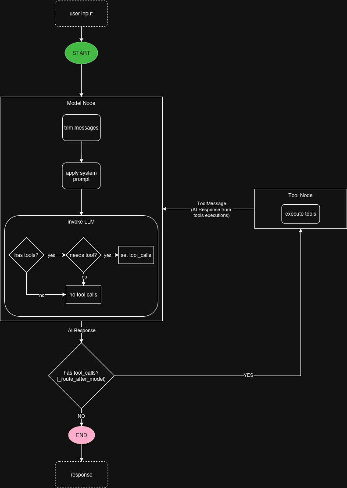

# Design Document: RAG Agent for Developer Onboarding

## Overview

This project implements an agentic application designed to assist with developer onboarding within a company.

However, I took it a step further and create a modular agent architecture that can be adapted to various usecases by swapping out the RAG knowledge base and modifying the StateGraph workflow.

To create a new agent for a different usecase, you need to add a new folder in the `docs/rag` directory with relevant documents, create a new `system_prompt.md` file with instructions for the LLM, and create a new workflow in the WorkflowManager.

To demonstrate this capability I added various knowledge bases in the `docs/rag` directory including stubs for customer support, interview prep, and eval agents. 

## Architecture

The application has four core components:

- **Agent:** A LangChain agent configured with a custom StateGraph workflow to manage conversation flow.
- **WorkflowManager:** Manages the StateGraph, defining nodes and routing logic for onboarding,
    login, tool execution, and conversation handling.
- **ToolManager:** Provides tools for retrieving context from a RAG knowledge base and managing employee records.
- **RAGManager:** Handles retrieval-augmented generation using a vector store built from company documentation.

Additionally we have a Controller class to orchestrate interactions between these components and an App class which is the main entry point for the application and is responsible for initializing the Controller and taking user input.

### Key Design Decisions

**StateGraph Workflow:** The use of a StateGraph allows for clear definition of conversation states and transitions, making it easier to manage complex interactions.

**ToolManager:** Abstracting tool management into its own component allows for easy addition or modification of tools and state management without impacting other parts of the system.

**Llama3.2 and Ollama:** I chose to use Ollama for ease of local development and cost savings. Llama3.2 is a fast and capable model for this usecase and works well with tools and RAG. My first choice was Gemma3 but it doesn't work with tools.

**Object oriented design:** Easy to test, manage complexity, and extend functionality in the future.

**Production Considerations:** 
- Conversation persistence using MemorySaver with thread_id
- Automatic message trimming to stay under token limits
- Streaming output for real-time user experience
- Comprehensive error handling validated across test suite

### Agent Tools

This agent has access to three tools:

- **retrieve_context:** Get relevant documents from the RAG knowledge base and return them as context for the LLM.
- **employee_lookup:** Get employee information from the pre-populated JSON database based on employee name. 
- **create_employee_profile:** Create a new employee profile and add it to the JSON database.

These three tools demonstrate core requirements: RAG retrieval, read operations (lookup), and write operations (create profile).

### Employee Database

The system uses a pre-populated JSON file (`data/employee_db.json`) containing 10 sample employees with usernames, roles, and departments. This allows the agent to demonstrate employee lookup functionality without requiring authentication or complex database setup. New employees can be added via the `create_employee_profile` tool.

## LangGraph Workflow

The LangGraph uses a StateGraph to define a simple, focused conversation flow: **user input → model → tools (if needed) → model → response**. 

The workflow is intentionally minimal and follows the standard ReAct pattern:

1. **User input** enters the system
2. **Model node** processes the input:
   - Trims message history to stay within token limits
   - Applies the system prompt
   - Invokes the LLM
3. **Routing decision**: Does the model want to use tools?
   - **YES** → Route to tools node, execute tools, return to model
   - **NO** → End and return response to user

The agent can use the `retrieve_context` tool to get relevant information from the RAG knowledge base, `employee_lookup` to retrieve employee information from the pre-populated database, or `create_employee_profile` to add new employees.

I chose to create a StateGraph manually rather than using `create_react_agent()` to have full visibility into state transitions and demonstrate knowledge of LangGraph fundamentals.

## RAG Implementation

Our RAGManager class is responsible for loading documents, creating embeddings, and setting up the vector store for retrieval. We are using an in memory vector store for simplicity. 

- **Vector Store:** InMemoryVectorStore for fast local development
- **Documents:** 13 markdown files covering setup, testing, deployment, security, etc.
- **Chunking:** RecursiveCharacterTextSplitter (1000 char chunks, 200 char overlap)
- **Embeddings:** OllamaEmbeddings for local, privacy-preserving embeddings
- **Retrieval:** k=2 documents, truncated to 500 chars per document
- **Optimization Rationale:** Balanced between context richness and staying under the 2000 token model limit

### RAG Knowledge Base

The example here is a developer onboarding assistant that can answer questions about a fictional company's codebase and policies.

This agent can be adapted for various usecases by creating a folder in the `docs/rag` directory. More example documents have been provided to show how to extend the agent's capabilities, but the developer onboarding assistant is the most complete implementation.

## Testing & Evaluation

- 72 passing unit tests
- 4 LangSmith evalution datasets
- LLM-as-judge evaluator

## Tradeoffs

### In-memory Vector Store and JSON Employee DB

I chose to use an in-memory vector store for simplicity, but this limits scalability and persistence. For a production environment, I would use a managed vector database like Pinecone or Weaviate.

I'm also using a JSON file for employee records. This is suitable for demonstration but would need to be replaced with a real database (PostgreSQL, MongoDB, etc.) for production use.

## What I would improve

- More eval tests
- 100% coverage on unit tests
- Better prompt engineering
- Better error handling and logging
- PII redaction

I would also make workflows more modular and reusable across different agents.
